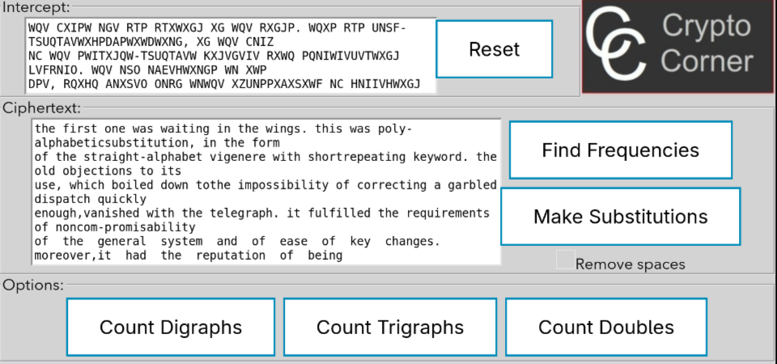
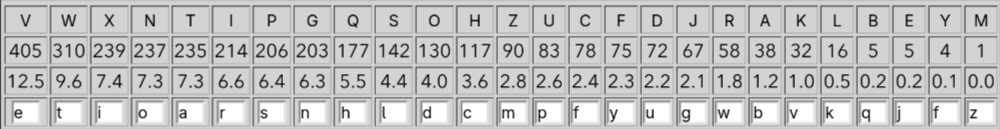

# Laborator 2

## Criptanaliza cifrurilor monoalfabetice

## 1. Scopul lucrării

Scopul acestei lucrări de laborator este studiul și aplicarea metodelor de criptanaliză a cifrurilor monoalfabetice prin analiza frecvenței apariției literelor. Lucrarea vizează înțelegerea vulnerabilităților sistemelor de criptare prin substituție simplă și dezvoltarea abilităților practice de decodificare a mesajelor criptate.

## 2. Baza teoretică

### 2.1. Cifruri monoalfabetice

Cifrurile monoalfabetice reprezintă sisteme de criptare în care fiecare literă din textul clar este înlocuită în mod consistent cu o altă literă sau simbol din alfabetul criptat. Punctul slab al acestor sisteme constă în păstrarea frecvenței relative de apariție a literelor din limba originală.

### 2.2. Analiza frecvenței literelor

Fiecare limbă naturală are o distribuție caracteristică a frecvenței de apariție a literelor. Pentru limba română, cele mai frecvente litere sunt:

- **E** (11,47%)
- **I** și **A** (aproximativ 9,95-9,96%)
- **R** (6,82%)
- **N** (6,47%)
- **U** (6,20%)
- **T** (6,04%)

Pentru limba engleză, distribuția este:

- **E** (12,7%)
- **T** (9,06%)
- **A** (8,17%)
- **O** (7,51%)
- **I** (6,97%)
- **N** (6,75%)

### 2.3. Metodologia atacului prin analiza frecvențelor

Procesul de criptanaliză prin analiza frecvențelor cuprinde următorii pași:

1. **Calcularea frecvenței literelor** din textul criptat
2. **Compararea** acestor frecvențe cu frecvențele standard ale limbii presupuse
3. **Identificarea corespondenței** între literele criptate și cele din textul clar
4. **Verificarea** prin analiza digrafelor (perechi de litere) și trigrafelor (triplete de litere)
5. **Ajustarea** substituțiilor până la obținerea unui text coerent

Elemente suplimentare care facilitează criptanaliza:

- **Digrafele frecvente** în engleză: TH, HE, AN, IN, ER, ON
- **Trigrafele frecvente**: THE, AND, THA, ENT, ION
- **Cuvinte de o literă**: A, I (în engleză)
- **Litere duble frecvente**: SS, EE, TT, OO, FF

## 3. Analiza practică

### 3.1. Interceptarea și analiza

În cadrul lucrării am utilizat instrumentul Crypto Corner pentru analiza unui mesaj criptat în limba engleză. Interfața aplicației este prezentată în Figura 1.

**Figura 1**: Interfața aplicației Crypto Corner pentru criptanaliza prin analiza frecvențelor

Aplicația oferă următoarele funcționalități:

- **Intercept**: zona de introducere a textului criptat
- **Ciphertext**: zona de vizualizare a textului descifrat parțial
- **Find Frequencies**: calcul automat al frecvențelor literelor
- **Make Substitutions**: aplicarea substituțiilor manuale
- **Count Digraphs/Trigraphs/Doubles**: analiza structurilor caracteristice

### 3.2. Analiza frecvențelor

După introducerea textului criptat, aplicația a calculat frecvențele de apariție ale fiecărei litere, rezultatele fiind prezentate în Figura 2.

**Figura 2**: Tabelul frecvențelor literelor din textul criptat comparat cu frecvențele standard ale limbii engleze

Din analiza tabelului observăm:

- Literele cele mai frecvente în textul criptat necesită o comparație cu literele E, T, A, O, I, N din limba engleză
- Diferențele între frecvențe permit identificarea probabilă a corespondenței între litere
- Abaterea de la frecvențele standard poate indica lungimea insuficientă a textului sau caracteristici particulare ale mesajului

### 3.3. Procesul de decodificare

Procesul de decodificare a urmat următorii pași:

1. **Identificarea literei E**: Litera cea mai frecventă în textul criptat a fost presupusă a corespunde lui "e"
2. **Identificarea digrafelor**: Secvențe frecvente de tip "X*E" au fost analizate pentru identificarea lui "THE"
3. **Substituții iterative**: Pe baza cuvintelor parțial descifrate, am identificat treptat alte litere
4. **Verificarea consistenței**: Fiecare substituție a fost verificată în contextul întregului mesaj
5. **Completarea alfabetului**: Literele rămase au fost deduse din contextul cuvintelor descifrate

## 4. Rezultate și observații

### 4.1. Rezultate obținute

the first one was waiting in the wings. this was poly-alphabeticsubstitution, in the form
of the straight-alphabet vigenere with shortrepeating keyword. the old objections to its
use, which boiled down tothe impossibility of correcting a garbled dispatch quickly
enough,vanished with the telegraph. it fulfilled the requirements of noncom-promisability
of  the  general  system  and  of  ease  of  key  changes.  moreover,it  had  the  reputation  of  being
unbreakable—which, if its cryptogramswere not divided into words, it largely was. the military
adopted  it  atonce.then,  in  1863,  a  retired  prussian  infantry  major  discovered  thegeneral
solution for the periodic polyalpha-betic substitution. at onestroke he demolished the
only impregnable structure in cryptography.signal officers, compelled to provide secure
communications,  huntedfrantically  for  new  field  ciphers.  they  found  many  good  ideas  in
thewritings  of  the  dilettante  cryptographers  who  had  proposed  ciphers  forthe  protection
of private messages. soon some of these systems wereserving in the various armies of europe
and the americas. more ideascame from army officers who had studied cryptography in the courses
insignal communication that the national military academies, such as st.cyr, had added in the
mid-1800s. inevitably, cryptanalysts—who wereeither amateurs or soldiers with a professional
interest, for fullprofessionals there were none—replied with new techniques for breakingthe
new ciphers. from the slow crawl of nomenclator days, when theintroduction of a special group
meaning disregard the preceding groupwould constitute a remarkable technical advance, the race
betweenoffense  and  defense  in  cryptology  acclerated  to  its  modern  pace.the  history  of
cryptology from the decade that saw both the death ofthe black chambers and the birth of the
telegraph  to  world  war  i  is  thusa  story  of  internal  development.  without  rossignols  or
willeses, andwithout major wars or diplomatic struggles, cryptology could notinfluence world
events,  and,  efcept  for  one  or  two  unusual  cases,  it  didnot.  the  telegraph  launched  this
evolution  of  cryptology.  it  broke  the  monopoly  of  the  nomenclator.  thenomenclator  had
reigned for 450 years as a general, all-purpose system,but it could not meet the new requirements
either of high-leveldiplomatic or military communications or of low-level
signalcommunications,  which  the  telegraph  had  engendered.  each  called  for  itsown  kind  of
cryptosystem, a specialized one. signal officers ranked thesesystems in a hierarchy, rising from
the simple and flefible and easilysolved to the eftensive and hard to solve. the telegraph
thus stimulatedthe invention of many new ciphers and, by reaction, many new methodsof crypt-
analysis,  and  compelled  their  arrangement  in  a  scale  ofcomplefity.many  of  these  ciphers  and
techniques  have  become  classic  and  are  inuse  today.  moreover,  cryptography  still  functions
through a hierarchyand employs a multitude of special systems. the telegraph therebyfurnished
cryptography with the structure and the content that it stillhas. it made it what it is
today. all these things have antecedents, and just as the telegraph itself did,so were there
precursors  of  the  cryptographic  systems  that  itengendered.one  cipher  system  invented
before  the  telegraph  was  so  far  ahead  ofits  time,  and  so  much  in  the  spirit  of  the  later
inventions, that it deservesto be classed with them. indeed, it deserves the front rank
among them,for this system was beyond doubt the most remarkable of all. so wellconceived was it
that today, more than a century and a half of rapidtechnological progress after its invention,
it remains in active use.but then it was invented by a remarkable man, a well-known
writer,agriculturalist, bibliophile, architect, diplomat, gadgeteer, and statesmannamed
thomas jefferson. he called it his "wheel cypher," and it seemslikely that he invented it
either during 1790 to 1793 or during 1797 to1800.

## 5. Concluzii

Lucrarea de laborator a demonstrat:

1. **Vulnerabilitatea intrinsecă** a cifrurilor monoalfabetice în fața atacurilor bazate pe analiza frecvențelor
2. **Importanța lungimii textului** pentru succesul criptanalizei
3. **Necesitatea unor sisteme criptografice mai complexe** (policifre, cifruri moderne) pentru asigurarea securității reale
4. **Valoarea abordării metodice** în procesul de criptanaliză

Cifrurile monoalfabetice, deși istorice și educaționale, nu oferă securitate suficientă pentru aplicații moderne. Această lucrare evidențiază importanța înțelegerii fundamentelor criptografiei pentru aprecierea complexității sistemelor moderne de securitate.

**\*\***Repository GitHub:**\*\*** **[**https://github.com/Gheorghe2973/CS**](**https://github.com/Gheorghe2973/CS**)**
